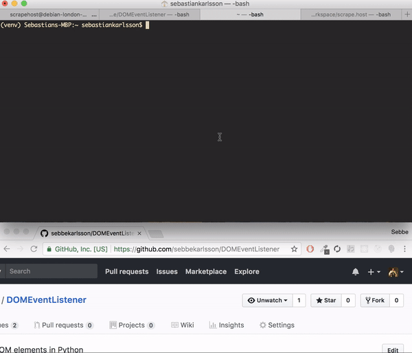

# DOMEventListener
> Subscripe on DOM elements, trigger methods when they change

## Notes
* Operates without a database by default
* __can__ operate with whatever database you want

## Usage
> Example: _Subscribing on the stackoverflow feed_:

    from domeventlistener.listen import Listener

    # your event handler
    def event_handler(event_type, data):
        print(event_type, data)

    listener = Listener(
        'https://stackoverflow.com/questions',
        '#mainbar',
        event_handler
    )

    # mount it on the element
    listener.mount()

    try:
        listener.run()
    except KeyboardInterrupt():
        quit()

> For example, when the DOM has changed the `event_handler` defined will print  
> something like:

    'changed', <unified diff between the new data and the old>

### Changing where data is stored
> By default, the element is stored in the `RAM` memory, you can change this  
> by setting read and write functions.

> For example, if you want to use _MongoDB_:

    from domeventlistener.listen import Listener
    from myapp.mongo import db
    
    
    def read_element():
        return str(db.collections.find_one({'name': 'element'})['element_str'])

    def write_element(element_str):
        return db.collections.update_one(
            {'name': 'element', 'element_str': element_str},
            upsert=True
        )
    
    ...

    listener = Listener(
        'https://stackoverflow.com/questions',
        '#mainbar',
        event_handler,
        read_element=read_element,
        write_element=write_element
    )
    ...

## Using with selenium + chromedriver
> You can set the chrome attribute to use selenium webdriver:

    ...

    mydriver = webdriver.Chrome(
        executable_path=config['chrome_driver'],
        chrome_options=chrome_options
    )

    listener = Listener(
        'https://stackoverflow.com/questions',
        '#mainbar',
        event_handler,
        read_element=read_element,
        write_element=write_element,
        chrome=mydriver # passing in my driver to use selenium + chromedriver
    )
    ...

## Pooling
> Running multiple listeners at the same time:

    from domeventlistener.listen import Listener
    from domeventlistener.pool import ListenPool

    # my event handler
    def event_handler(event_type, data):
        print(event_type, data)

    listener0 = Listener(
        domain='https://github.com/sebbekarlsson',
        query='a[title="Stars"]',
        event_handler=event_handler
    )
    
    pool = ListenPool()
     
    # deploy as many listeners as you want.
    # The "pool" will automaticaly start them once deployed using this method.
    pool.deploy_listener(listener0) 

## Using the domeventlistener in your application

    from domeventlistener.listen import Listener

    
    listener = Listener(
        domain='http://example.org',
        query='h1'
    )
    
    # boolean    string
    has_changed, new_element_str = listener.poll_change()

## Type of events
* `changed` - the DOM was changed
* `emptied` - the DOM is now empty / lost

## CLI (Command line interface)

## Installation
> Install with pip:

    pip install DOMEventListener

> Install by cloning down:

    git clone <this-project>
    cd <this-project>
    python setup.py install

## Development
### Unit testing
> First install:

    pip install pytest pytest-cov

> Run the tests:

    ./test.sh

> To run thests with chromedriver + selenium

    echo '{"chromedriver": "/path/to/chromedriver"}' > domeventlistener/tests/config.json

## License
> License: [gpl-3.0](LICENSE.md)
